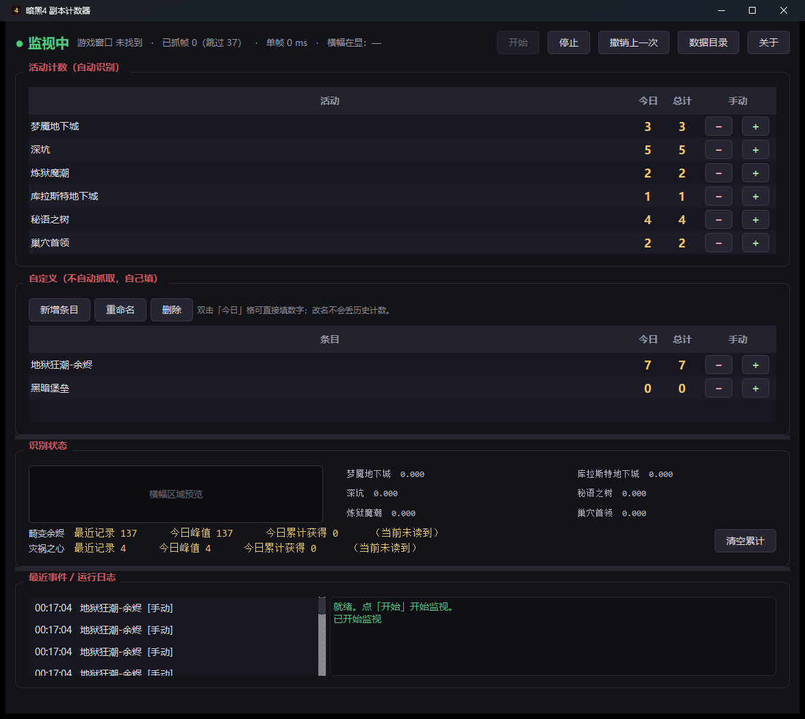

# 暗黑4 副本计数器（d4-tracker）

玩《暗黑破坏神IV》时，**自动统计你打了多少次各类副本和活动**，不用手动记账。

**只读屏幕像素**——不读游戏内存、不注入 DLL、不装键盘钩子、不模拟输入。



## 能计什么

| 活动 | 怎么判断"打完了" | 自动 |
|---|---|---|
| 梦魇地下城 | 顶部居中横幅 `梦魇地下城完成` | ✅ |
| 深坑 | 顶部居中横幅 `地下城完成` | ✅ |
| 炼狱魔潮 | 波次计数器 `波次：10/10` | ✅ |
| 库拉斯特地下城 | 右侧目标面板 `区域通关` | ✅ |
| 秘语之树 | 中央奖励面板 `使用此宝匣获取你的奖励。` | ✅ |
| 巢穴首领 | 目标行从 `击败<首领>…` 变成 `打开<首领>的秘宝` | ✅ |
| 地狱狂潮 | 小地图左侧的**畸变余烬 / 灾祸之心**数值 | ✅ 读数 |
| 想记的任何东西 | 自己加条目，`+1` / `−1` / 直接填数字 | 手动 |

## 快速开始

1. 到 [Releases](https://github.com/senyaqy/d4-tracker/releases) 下载 `D4Tracker.exe`
   （或从源码跑，见下）
2. 双击运行，点「开始」
3. 进游戏正常玩 —— 打完一把它会自己记账

窗口里能实时看到每类模板的**当前匹配分数**和**横幅区域预览**，所以万一识别不准，
你一眼就能看出是哪块区域的问题。

> **参数**：游戏用**窗口化(全屏) / 无边框窗口**，关闭 HDR，字体大小保持默认。
> 独占全屏下抓不到画面（这是 Windows 的限制，不是工具的问题）。

## 它是怎么工作的

D4 没有战斗日志、没有开放 API（暴雪论坛从 2023 年至今的请求帖没有任何回应）；
唯一的结构化数据源是 Overwolf GEP，但要引入整个 Overwolf 平台。

暴雪蓝贴点名 TurboHUD4（读内存）可**永久封号**，判据是是否 "modify / automate /
interfere"。屏幕捕获 + 图像识别不碰进程、不注入、不模拟输入，是同类工具
（d4lf、Diablo4Companion）长期公开使用且未被处理的做法。

技术上：`PrintWindow(PW_RENDERFULLCONTENT)` 让窗口自己渲染一份到我们的 DC（**游戏被
别的窗口挡住也能抓到**），再对固定的 UI 区域做**文字掩膜 + IoU 模板匹配**；地狱狂潮那
两个数字则跳过检测模型直接送识别，并用滑动窗口投票压噪声。

## 实测数据

跑在 2560×1440、i7 + 16 核的机器上：

| 状态 | CPU | 内存 |
|---|---|---|
| 游戏在前台、3fps 持续抓帧 | **20.6% 单核**（总算力 1.3%） | 259 MB |
| 游戏不在前台（自动跳过抓帧） | **2.3% 单核** | 213 MB |

**完全离线可用**：代码里没有任何网络调用，运行时不产生任何 TCP 连接，
OCR 模型和模板都打进 exe 里了。

## 从源码运行

```powershell
py -3.13 -m venv .venv
.venv\Scripts\python.exe -m pip install -r requirements.txt -i https://pypi.tuna.tsinghua.edu.cn/simple
.\run-counter.cmd          # 主界面
.\run-sampler.cmd          # 样本采集器（想加新副本类型时用）
```

打包成 exe：

```powershell
.venv\Scripts\python.exe tools\make_icon.py
.venv\Scripts\python.exe tools\build_exe.py              # 单文件夹版
.venv\Scripts\python.exe tools\build_exe.py --onefile    # 单文件版
```

自检（不需要游戏、不需要样本）：

```powershell
.venv\Scripts\python.exe -m d4tracker --selftest
```

## 目录

```
run_tracker.py    打包入口（也是 exe 实际执行的脚本，带全局异常兜底）
run-counter.cmd   源码方式启动计数器
run-sampler.cmd   源码方式启动样本采集器
d4tracker/
  capture.py    窗口查找 + 抓帧（PrintWindow 主路径 / BitBlt 回退）
  hotkeys.py    全局热键（Win32 RegisterHotKey，无键盘钩子）
  imageio.py    非 ASCII 路径安全的图像读写
  paths.py      源码 / 打包两种形态下的只读资源与可写数据目录
  sampler.py    样本采集器：环形缓冲 + 热键落盘
  detect.py     完成信号识别（固定 ROI 比对 + 条带滑动搜索）
  counter.py    状态机：逐帧分数 -> 事件（上升沿 + 释放间隔 + 冷却）
  values.py     数值读取（地狱狂潮余烬/灾祸之心）：多变体 + 窗口投票
  store.py      计数存储（SQLite：events 事件表 + readings 数值时间线）
  kinds.py      目标活动登记表 + 样本期望映射
  monitor.py    实时监视 + 主界面
config/         热键 → 标签映射（采集器用）
templates/      6 个信号模板 + templates.json（只读资源，进 exe）
assets/         图标（只读资源，进 exe）
data/           counts.db、selftest.log、crash.log（可写数据，不进 exe）
dist/           打包产物
tools/
  snapshot.py   抓帧通道快速自检
  contact.py    样本联络表（每组抽 9 帧拼图 + 帧间变化点）
  crop.py       按区域裁剪并纵排多帧（读原生分辨率文案）
  ocr_probe.py  RapidOCR 探针，把区域文字打出来
  find_signal.py 全屏 OCR 找瞬现文案（不预设区域）
  train.py      从样本裁出模板
  validate.py   全样本分离度与阈值标定
  replay.py     状态机回放（按期望类型校验）
  status.py     诊断：数据库里记了什么 + 各模板此刻的分数
  bench.py      分段计时：抓帧 / 匹配 / 数值读取各占多少
  make_icon.py  生成多尺寸 ico
  build_exe.py  PyInstaller 打包
```

## 打包产物

两种产物可以装在同一个目录、**共用同一份 `data/counts.db`**（否则各记各的，计数会分裂）：

| 产物 | 体积 | 启动 | 用途 |
|---|---|---|---|
| `D4Tracker.exe` + 支撑目录 | 5.3 MB + 314 MB | 约 1 秒 | 日常用（推荐） |
| `D4Tracker-portable.exe` | 130.7 MB 单文件 | 约 3 秒 | 拷到别的机器 |

EXE 在 [Releases](https://github.com/senyaqy/d4-tracker/releases) 页面下载。
打包命令见上面的「从源码运行」。

### 界面

* **三段可拖拽**：活动计数 / 识别状态 / 日志，中间的分界条能拖，窗口大小和分界线
  位置都记在 `data/ui.ini` 里。
* **每行都有 `−` 和 `+`**：放在一起就是为了防误触。`−` 的语义是"删掉该项目最近一条
  记录"，不是减一个负数 —— 计数是数出来的，往回退就该少一条，这样任何一行的数都能
  追到具体时刻。
* **双击「今日」格直接填数字**：多了补记录、少了删最新的几条，用来把已有进度补进来。
* **自定义条目**（不自动抓取，自己填）：可新增 / 重命名 / 删除。改名会连同历史记录
  一起改，否则旧计数会"消失"；删除会连同历史一起清掉。
* **悬浮窗**：点工具条上的「悬浮窗」开启，之后**最小化主窗口**就会在屏幕上留一个
  半透明小窗，只显示各项目的**今日 / 总计**次数。拖动可移位置，右键隐藏，位置记在
  `data/ui.ini` 里。恢复主窗口它就自动收起。

  两个细节值得说明：半透明是**画出来的**（背景带 alpha、文字保持不透明），不是整体
  降透明度 —— 后者会把字一起淡化，贴在游戏画面上读不清；窗口还用了
  `WA_ShowWithoutActivating`，显示时不会把游戏切到后台（否则反而会让抓帧跳过）。

  **悬浮窗默认从屏幕捕获里排除**（`SetWindowDisplayAffinity`），这样它压在某块识别
  区域上也不会干扰模板匹配 —— 代价是在 OBS / 截图里同样看不见它。想边直播边显示
  计数，设环境变量 `D4TRACKER_OVERLAY_CAPTURABLE=1` 关掉这个排除。
* 设置存 `data/ui.ini` 而不是注册表：便携、看得见、删掉就重置。

## 信号与判定（实测）

各类活动的"完成"表现**不在同一处**，所以模板各自带 ROI（由样本实测得到，按参考
分辨率 2560x1440 归一化存储）：

| 活动 | 信号文案 | 位置 | 模板 |
|---|---|---|---|
| 梦魇地下城 | `梦魇地下城完成` | 顶部居中横幅 (1080,45) | `nightmare_complete` |
| 深坑 | `地下城完成` | 顶部居中横幅 (1080,45) | `dungeon_complete` |
| 炼狱魔潮 | `波次：10/10` | 上方波次计数 (1898,45) | `hordes_complete` |
| 库拉斯特地下城 | `区域通关` | 右侧目标面板 (2330,603) | `kurast_complete` |
| 秘语之树 | `使用此宝匣获取你的奖励。` | 中央奖励面板 (1540,685) | `tree_turnin` |
| 巢穴首领 | `打开<首领>的秘宝` | 右侧第一条目标行（条带搜索） | `lair_complete` |

### 巢穴首领：条带内滑动搜索

击杀后右侧目标行会这样演变（实测 220211 那组）::

    #000  击败齐尔领主的折磨回响
    #008  (无文字)                 <- 过渡
    #010  打开齐尔领主的秘宝         <- 完成信号，停留约 4~6 帧
    #016  (无文字)
    #020  使用血腥祭坛召唤齐尔领主的折磨回响   <- 新一轮

首领名长度不同，整串的起止位置就不同，**固定 ROI 一定对不齐**。所以用了新的模板类型：
在 y 484~528 那条目标行内**滑动搜索不变的尾巴 `的秘宝`**。

两个必须注意的点：

* 条带只盖第一条目标行。下面常驻的加成说明 `提升小队成员从秘宝中获得额外宝物的几率`
  里也有"秘宝"二字，靠 y 分隔干净。
* 搜索的评分必须在**最佳位置上算真正的 IoU**。第一版只算召回（模板像素被覆盖的比例），
  结果在密集文字处随便对上一部分就能拿 0.58~0.70，几乎所有巢穴首领样本都被误报；
  把并集也计进来才分得开（分离度 0.631）。

### 数值型指标：地狱狂潮的余烬 / 灾祸之心

这两个**不是事件而是数值**：随拾取增长、去祭坛时被消耗。所以机制不同 —— 周期性读数字，
只在数值变化时落库，于是 `readings` 表本身就是一条变化时间线，"今日峰值"和
"今日累计获得"（只累加正增量，消耗导致的下降不计）都从它算出来。

位置：小地图左侧那块面板，上面是倒计时 `地狱狂潮：48:30`，下面两个圆形图标
（左=火焰=畸变余烬，右=恶魔=灾祸之心），数字在图标正下方，字形只有约 12x23 像素。

三个坑：

1. **检测模型根本读不到它。** RapidOCR 完整流程里 `min_height` 默认 30，23 像素高的
   字形被高度过滤器丢掉；把 `min_height` 调到 6 也没用（实测 6/10/30 结果一样）。
   直接调 `text_recognizer` 就对了，而且只要几毫秒。
2. **固定阈值切分在亮场景下失效。** 实测亮场景里阈值 150 会把整块面板算成前景
   （包围盒变成整个 ROI），读出 `57`、`26` 这种垃圾。改用局部 Otsu。
3. **单帧读数仍然不能信。** 局部 Otsu 让余烬稳了，但灾祸之心的 `7` 会有一半概率
   退化成 `1`（装饰字体的笔画被二值化切断）。

最终用**多变体 + 时间窗口投票**：每帧用三种切分各读一次，结果投进滑动窗口取众数，
并要求众数明显领先第二名。实测三个样本六个槽位全部给出正确众数，优势很大
（正确值 28~39 票，第二名最多 8 票）。代价是两槽约 30~50ms，和抓帧一个量级，
所以真机约 1Hz 读一次即可（余烬变化很慢）。

### 两个差点做错的判断

**1. 右上角不是信号区。** 同一块区域实测出现过 `地狱狂潮：48:23`（狂潮倒计时）、
`层数 4/3`（地下城进度）、`角色C…火焰抗性`（角色面板）、`众灵给了你力量`（祭坛）。
它是通用信息区。

**2. `已完成地下城` 是通用标记，不能当作炼狱魔潮的信号。** 第一版拿它做
`hordes_complete` 的模板，回放时发现它在**深坑样本里同样出现**（同一位置、同样文案），
把深坑算成了魔潮（误报到 0.69~0.74）。改用 `波次：10/10` —— 波次计数器只有魔潮有。

### 文字掩膜：固定阈值跨面板不可通用

* 顶部横幅是接近纯白的字，阈值 190 能取到；
* 秘语之树奖励面板的字只有 120~171，用 190 **一个像素都取不到**；
* 若改用 70，暗场景下整片黑底都会被当成文字（实测暗色像素占 ROI 的 86%）。

所以阈值由**建模板时对该 ROI 跑 Otsu** 定下并固定存进模板。Otsu 对这种"黑底 + 灰字"
的双峰分布很准；固定不变是为了让同一面板在不同帧上得到一致的掩膜（自适应阈值会让
IoU 没法比）。各模板实测阈值 61~125，文字占比 7.7%~15.2% —— 是文字该有的密度。

### 验证结果

`tools/validate.py` 的正确口径：**对每个模板，负样本 = 所有"期望类型不是它"的目录**，
包含其它类型的正例。第一版只把「反例/手动抓帧/测试样本」当负样本，于是完全看不见
"正例但类型认错"这类最隐蔽的错误。

| 模板 | 正例最高 | 负例最高 | 分离度 |
|---|---|---|---|
| 梦魇地下城 | 1.000 | 0.265 | 0.735 |
| 深坑 | 1.000 | 0.363 | 0.637 |
| 炼狱魔潮 | 1.000 | 0.158 | 0.842 |
| 库拉斯特地下城 | 1.000 | 0.225 | 0.775 |
| 秘语之树 | 1.000 | 0.159 | 0.841 |
| 巢穴首领（条带搜索） | 1.000 | 0.369 | 0.631 |

`tools/replay.py` 按"期望类型"逐组校验：**23/33 通过，零误报**（既无类型认错，也无
重复计数）。10 组"缺事件"全部是**样本里根本没有信号**：巢穴首领 7 组只有 1 组抓到了
`打开…的秘宝` 那一刻（它只停留 4~6 帧），另有梦魇 2 组、深坑 1 组、秘语之树 1 组是
采集时序错过。这是采集问题，不是检测问题。

### 状态机：一次完成只能算一次

横幅/面板停留 1.3~4.7 秒，3fps 下就是 4~14 帧连续命中。**必须只算一次。**

* 连续命中 `confirm_frames` 帧才算"出现"（滤单帧噪点）；
* **消失**的判定要更迟钝：必须连续 `release_gap` 秒低于阈值，才认为这次结束了 ——
  否则淡出时分数在阈值附近抖动，会被拆成两次事件；
* 再加一道 per-kind 冷却兜底（真副本不可能 20 秒内完成两次）。

梦魇 `210543` 的横幅连续 14 帧在阈值之上，状态机在第 2 帧确认并触发一次，之后进入
active 状态不再重复。


## 环境

Python 3.13（`.venv` 已就绪，909 MB），依赖：PySide6 / opencv-python-headless /
numpy / mss / rapidocr-onnxruntime。版本都锁在 `requirements.txt` 里，环境删了也能重建：

```powershell
py -3.13 -m venv .venv
.venv\Scripts\python.exe -m pip install -r requirements.txt `
    -i https://pypi.tuna.tsinghua.edu.cn/simple
```

> `.venv` 只对**开发**有用（采集样本、重新标定模板、重打 exe）。发布出去的 exe 是
> 自包含的，删掉 `.venv` 不影响它运行。

两个必须记住的坑：

- 选 `opencv-python-headless` 而不是 `opencv-python`：后者自带一套 Qt 插件会和
  PySide6 打架。但 **RapidOCR 依赖 `opencv-python`**，装完会把完整版拖回来，
  两者又装在同一个 `cv2` 目录下 —— 卸载任一个都会把共用的文件删掉，留下
  "pip 说已安装、`import cv2` 却失败"的状态。修复方式是
  `pip install --force-reinstall --no-deps opencv-python-headless`。
- `cv2.imread` / `cv2.imwrite` 在 Windows 上都不支持非 ASCII 路径：读返回 `None`，
  写**静默失败**（返回 `False` 不抛异常）。本项目标签全是中文，所以一律走
  `d4tracker/imageio.py`。

## 资源占用与联网

**完全离线可用。** 代码里没有任何网络调用（grep 过 `requests/urllib/socket/http`，
零命中），运行期间进程**没有任何 TCP 连接**（实测确认）。OCR 模型（13.4 MB，3 个
`.onnx`）和 6 个模板都打进包里，SQLite 是本地的。**唯一需要联网的是开发侧的
`pip install` 和打包**，跟运行时无关。

实测（2560x1440 全屏抓帧，16 核机器）：

| 状态 | CPU | 内存 |
|---|---|---|
| 游戏在前台、3fps 持续抓帧（GUI） | **20.6% 单核**（16 核总算力 1.3%） | 259 MB |
| 游戏不在前台（自动跳过抓帧） | **2.3% 单核** | 213 MB |
| 打包后 exe 刚启动未监视 | ≈0 | 133 MB |

分段计时（`tools/bench.py`，可随时复测）：

| 阶段 | 均值 | 备注 |
|---|---|---|
| 抓帧 | ~29 ms | 绝对大头，PrintWindow/BitBlt 的固有成本 |
| 模板匹配 | ~2 ms | 可忽略 |
| 数值读取 | 中位 14 ms | 每 6 帧一次（0.5Hz），变化很慢够用 |

### 为此做的两处优化

1. **抓帧去掉两次整帧拷贝**（59ms → 29ms）。原来每帧 `string_at` 拷一份 14.7MB、
   `ascontiguousarray` 再拷一份，而实际只用到 6 个小 ROI。改成 `np.ctypeslib.as_array`
   把 GDI 缓冲映射成零拷贝视图，只在切 ROI 时拷贝那一小块（`grab_window(copy=False)`，
   默认仍是 `True` 供外部调用方安全持有）。
2. **数值读取限制长宽比**。识别模型按高度归一化，一个 80×5 的包围盒归一化后宽度会撑到
   768，实测能跑到 300ms+ —— 那些"尖刺"就是它。数字的长宽比本来就稳定，直接滤掉
   比例异常的候选。另外把识别输入长边限制在 256。

单核占用从优化前的 **42%** 降到 **20.6%**，差不多砍半。

### 想更省电

窗口右上角「停止」即可（停止识别不影响已记录的计数）；游戏不在前台时本来就会跳过抓帧。
嫌开销还想再低可以 `--fps 2`，但横幅只停留 4~6 帧，2fps 下抓到的帧数偏少，不建议低于 2。

## 抓帧的关键事实

本机 D4 2560×1440 无边框全屏实测：

| 方式 | 耗时 | 结果 |
|---|---|---|
| `PrintWindow(PW_RENDERFULLCONTENT)` | ~40 ms | 正常画面，**窗口被遮挡也能抓到** |
| `BitBlt`（mss / ImageGrab 走的也是这条） | ~20 ms | 游戏被遮挡时返回一片平色（通道 std = 0） |
| `PrintWindow` 不带 RENDERFULLCONTENT | — | 全屏均匀灰，D3D 窗口的典型结果 |

因此：

- **不能用 mss / PIL.ImageGrab 做主路径**，独占全屏下会黑屏，被遮挡时会抓到遮挡物；
- `grab_window(method="auto")` 在游戏处于前台时先用 BitBlt（省一半），
  拿到平色就回退 PrintWindow；不在前台直接走 PrintWindow。

**性能上限约 25 fps**（PrintWindow 每帧 40ms，这是硬成本）。所以检测不能靠高帧率
轮询 —— 结算面板这类 UI 会停留数秒，2~3 fps 足够，靠"连续 N 帧稳定"去抖动。

## 识别不准怎么办

**1. 先看数据库里到底记了什么**

```powershell
.venv\Scripts\python.exe tools\status.py
```

它列出最近的事件（时间 / 分数 / 连续帧数 / 自动还是手动）、各类计数、数值读数；
游戏开着的话还会抓一帧，打印每个模板**此刻的分数**和它查的 ROI —— 一眼能看出
是识别没触发，还是压根没出现。

> 注意 exe 和源码运行用的是**两份不同的数据库**：
> exe 在 `dist\D4Tracker\data\counts.db`，源码在 `data\counts.db`。
> 读错那份会以为一条记录都没有。指定路径：`tools\status.py --db <路径>`

**2. 看自动留下的现场**

工具会自动把两类"没算上"的情况**连同画面一起存下来**，放在 `data\nearmiss\`：

| 情况 | 含义 |
|---|---|
| `*_near_*.png` | 分数到了 0.30 但没到阈值 0.55 —— 通常是位置偏了或文字变了 |
| `*_short_*.png` | **分数过了阈值，但连续帧数不够**（3fps 下需连续 2 帧 = 0.67 秒）—— 提示一闪而过 |

界面日志里也会同步写一行，例如：

```
秘语之树：命中但只持续 1 帧（需连续 2 帧），已忽略，图 nearmiss/0921-0123_tree_turnin_short_0.982.png
```

**这两张图就是"事后唯一能查的现场"**。没有它，只能重开一局复现 —— 秘语之树出过一次
零识别，当时没有任何现场可查，就是靠补上这个能力才定位的。每个模板最多保留 60 张，
自动滚动删除。

